# Tugas Praktikum 4 { Pertemuan ke 11 } 

|**Nama**|**NIM**|**Kelas**|**Matkul**|
|----|---|-----|------|
|Gladis Toti Anggraini |312310566|TI.23.A5|Basis Data|

# Soal Latihan Praktikum {Pegawai}

![image]

Perintah sql :
```
CREATE TABLE pegawai (
    idpegawai VARCHAR(5) PRIMARY KEY,
    nama_depan VARCHAR(10) NOT NULL,
    nama_belakang VARCHAR(15) NOT NULL,
    email VARCHAR(25) UNIQUE,
    telepon VARCHAR(15),
    tgl_kontrak DATE,
    id_job VARCHAR(5),
    gaji INT,
    tunjangan INT
);

INSERT INTO pegawai VALUES
    ('E001', 'Gladis', 'Toti', 'gladis@yahoo.com', '07117059004', '2005-09-01', 'L0001', 2000000, 500000),
	('E002', 'Oktavia', 'Rizkha', 'oktavia@yahoo.com', '081312345678', '2006-09-01', 'L0002', 2000000, 200000),
	('E003', 'Nurul', 'Aisyah', 'nurul@gmail.com', '081367384322', '2006-10-01', 'L0003', 1500000, NULL),
	('E004', 'Raditya', 'Tansy', 'tansy@gmail.com', '081363484342', '2006-10-01', 'L0004', 1500000, 9),
	('E005', 'Ananda', 'Ramadhani', 'nanda@plasa.com', '08163454555', '2007-09-01', 'L0005', 1250000, 9),
	('E006', 'Via', 'Nirmala', 'via@yahoo.com', '08527388432', '2008-09-01', 'L0006', 1750000, NULL);
```

- `CREATE TABLE pegawai` : untuk membuat sebuah tabel bernama "pegawai". Tabel ini akan digunakan untuk menyimpan informasi tentang pegawai.
- `PRIMARY KEY` : idpegawai diatur sebagai kunci utama (PRIMARY KEY) yang menandakan bahwa nilainya unik untuk setiap baris dan tidak dapat berulang.
- `NOT NULL` : untuk mengatur bahwa kolom nama_depan dan nama_belakang tidak boleh kosong (NULL).
- `INSERT INTO pegawai VALUES` : untuk menyisipkan data ke dalam tabel "pegawai". Setiap baris data adalah informasi tentang seorang pegawai, termasuk ID, nama, email, nomor telepon, tanggal kontrak, ID pekerjaan, gaji, dan tunjangan.


**1. Tampilkan pegawai yang gajinya bukan 2.000.000 dan 1.250.000 !**

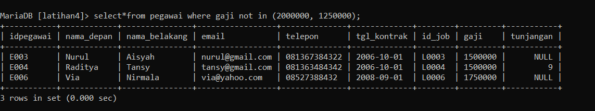

Perintah SQL `SELECT` untuk memilih data dari tabel "pegawai". Kriteria seleksi diberikan oleh klausa `WHERE`. Karena ingin memilih pegawai yang gajinya tidak sama dengan **2.000.000** atau **1.250.000**, jadi menggunakan operator `NOT IN` untuk mengecualikan nilai-nilai tersebut dari hasil seleksi.
- **'SELECT***' : Memilih semua kolom dari tabel "pegawai".
- **'FROM pegawai'** : Menentukan tabel yang akan dipilih.
- **'WHERE gaji NOT IN (2000000, 1250000)'** : Menyaring baris-baris dari tabel "pegawai" dimana nilai kolom "gaji" tidak sama dengan 2.000.000 atau 1.250.000.


**2. Tampilkan pegawai yang tunjangannya NULL!**

![image]

**NULL** adalah nilai yang menunjukkan bahwa data tidak memiliki nilai atau nilai tidak diketahui. Dalam konteks tabel "pegawai", kolom "tunjangan" yang memiliki nilai NULL menunjukkan bahwa pegawai tersebut mungkin belum menerima tunjangan atau data tunjangan belum diisi dalam basis data. Dengan memfilter pegawai berdasarkan nilai NULL pada kolom "tunjangan", dapat mengidentifikasi pegawai yang belum mendapat tunjangan.

- **SELECT*** : Memilih semua kolom dari tabel "pegawai".
- **FROM pegawai** : Menentukan tabel yang akan dipilih.
- **WHERE tunjangan IS NULL** : Menyaring baris-baris dari tabel "pegawai" dimana nilai kolom "tunjangan" adalah NULL.


**3. Tampilkan pegawai yang tunjangannya tidak NULL!**

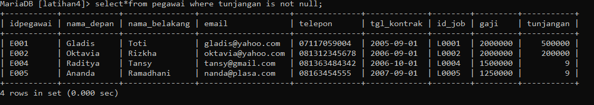


**NOT NULL** adalah sebuah konstrain dalam SQL yang digunakan untuk memastikan bahwa nilai dalam suatu kolom tidak boleh kosong (NULL). Jadi, ketika menggunakan klausa **'WHERE'** dengan **'IS NOT NULL'** pada kolom "tunjangan", kita mencari pegawai yang sudah memiliki nilai tunjangan yang telah ditetapkan, tidak ada yang kosong atau tidak diketahui. Ini membantu dalam mengidentifikasi pegawai yang telah menerima tunjangan atau yang datanya sudah lengkap terkait dengan tunjangan mereka.

- **SELECT*** : Memilih semua kolom dari tabel "pegawai".
- **FROM pegawai** : Menentukan tabel yang akan dipilih.
- **WHERE tunjangan IS NOT NULL** : Menyaring baris-baris dari tabel "pegawai" dimana nilai kolom "tunjangan" bukan NULL.


**4. Tampilkan/hitung jumlah baris/record tabel pegawai!**

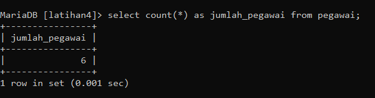

**COUNT(*)** : Menghitung jumlah baris atau record dalam tabel. Dalam konteks ini, digunakan untuk menghitung jumlah pegawai dalam tabel.


**5. Tampilkan/hitung jumlah total gaji di tabel pegawai!**

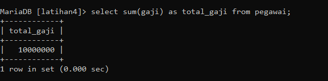

**SUM()** : Menghitung jumlah total dari nilai-nilai dalam kolom tertentu. Di sini, digunakan untuk menghitung total gaji dari semua pegawai.


**6. Tampilkan/hitung rata-rata gaji pegawai!**

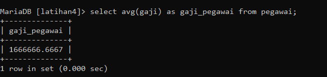

**AVG()** : Menghitung rata-rata dari nilai-nilai dalam kolom tertentu. Dalam tugas ini, digunakan untuk menghitung rata-rata gaji pegawai.


**7. Tampilkan gaji terkecil!**

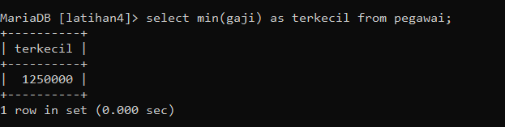

**MIN()** : Mengambil nilai terkecil dari kolom tertentu. Digunakan untuk menampilkan gaji terkecil dari pegawai.


**8. Tampilkan gaji terbesar!**

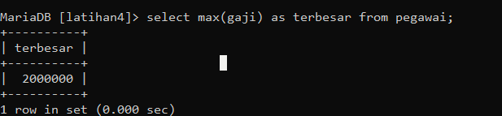

**MAX()** : Mengambil nilai terbesar dari kolom tertentu. Digunakan untuk menampilkan gaji terbesar dari pegawai.


# Soal Praktikum {Hewan}

![image]


Perintah sql :
```
CREATE TABLE hewan (
    id VARCHAR (5) PRIMARY KEY,
    name VARCHAR (10) NOT NULL,
    owner VARCHAR (10),
    species VARCHAR (10),
    sex enum('M', 'F')
    );

INSERT INTO hewan VALUES
    ('p1', 'Puffball', 'Diane', 'Hamster', 'F'),
    ('p2', 'Claws', 'Gwen', 'Cat', 'M'),
    ('p3', 'Fluffy', 'Haro 1d', 'Cat', 'F'),
    ('p4', 'Buffy', 'Haro 1d', 'Dog', 'F'),
    ('p5', 'Fang', 'Benny', 'Dog', 'M'),
    ('p6', 'Bowser', 'Diane', 'Dog', 'M'),
    ('p7', 'Chirpy', 'Gwen', 'Bird', 'F'),
    ('p8', 'Whistler', 'Gwen', 'Bird', NULL),
    ('p9', 'Slim', 'Benny', 'Snake', 'M');
```

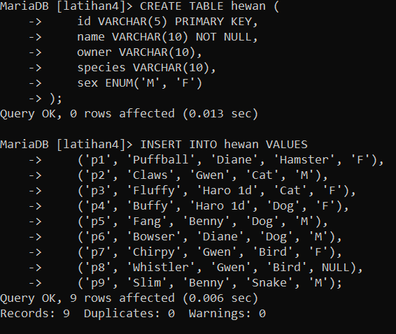


**1. Tampilkan jumlah hewan yang dimiliki setiap owner.**

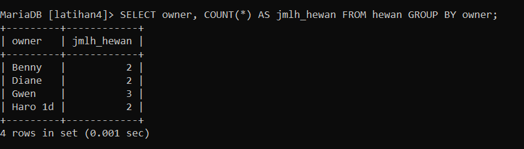

**2. Tampilkan jumlah hewan berdasarkan spesies**

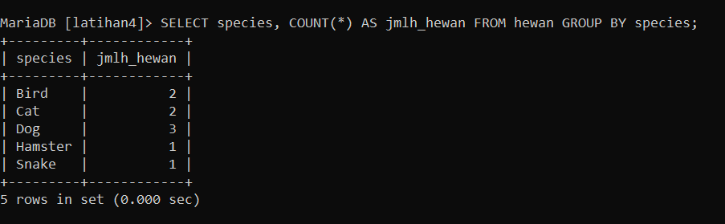

**3. Tampilkan jumlah hewan berdasarkan jenis kelamin**

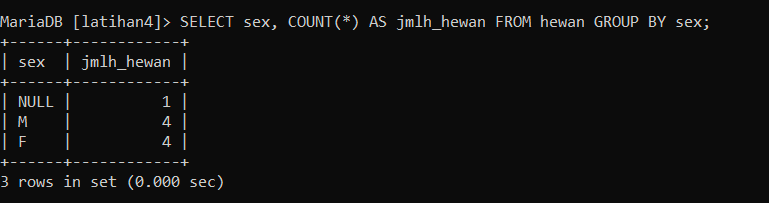

**4. Tampilkan jumlah hewan berdasarkan spesies dan jenis kelamin**

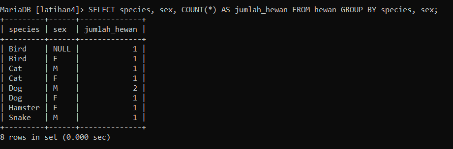

**5. Tampilkan jumlah hewan berdasarkan spesis (cat dan dog saja) dan jenis kelamin**

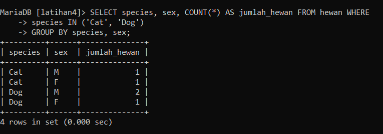

**6. Tampilkan jumlah hewan berdasarkan jenis kelamin yang diketahui saja**

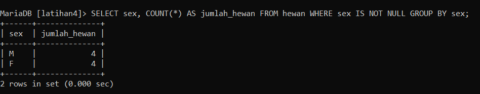


# Evaluasi dan Pertanyaan

**Tulis semua perintah-perintah SQL percobaan di atas beserta outputnya!**
```
CREATE TABLE pegawai (
    idpegawai VARCHAR(5) PRIMARY KEY,
    nama_depan VARCHAR(10) NOT NULL,
    nama_belakang VARCHAR(15) NOT NULL,
    email VARCHAR(25) UNIQUE,
    telepon VARCHAR(15),
    tgl_kontrak DATE,
    id_job VARCHAR(5),
    gaji INT,
    tunjangan INT
);

INSERT INTO pegawai VALUES
    ('E001', 'Gladis', 'Toti', 'gladis@yahoo.com', '07117059004', '2005-09-01', 'L0001', 2000000, 500000),
	('E002', 'Oktavia', 'Rizkha', 'oktavia@yahoo.com', '081312345678', '2006-09-01', 'L0002', 2000000, 200000),
	('E003', 'Nurul', 'Aisyah', 'nurul@gmail.com', '081367384322', '2006-10-01', 'L0003', 1500000, NULL),
	('E004', 'Raditya', 'Tansy', 'tansy@gmail.com', '081363484342', '2006-10-01', 'L0004', 1500000, 9),
	('E005', 'Ananda', 'Ramadhani', 'nanda@plasa.com', '08163454555', '2007-09-01', 'L0005', 1250000, 9),
	('E006', 'Via', 'Nirmala', 'via@yahoo.com', '08527388432', '2008-09-01', 'L0006', 1750000, NULL);

SELECT * FROM pegawai;

SELECT * FROM pegawai WHERE gaji NOT IN (2000000, 1250000);

SELECT * FROM pegawai WHERE tunjangan IS NULL;

SELECT * FROM pegawai WHERE tunjangan IS NOT NULL;

SELECT COUNT(*) AS jumlah_pegawai FROM pegawai;

SELECT SUM(gaji) AS total_gaji FROM pegawai;

SELECT AVG(gaji) AS rata_rata_gaji FROM pegawai;

SELECT MIN(gaji) AS gaji_terkecil FROM pegawai;

SELECT MAX(gaji) AS gaji_terbesar FROM pegawai;

CREATE TABLE hewan (
    id VARCHAR (5) PRIMARY KEY,
    name VARCHAR (10) NOT NULL,
    owner VARCHAR (10),
    species VARCHAR (10),
    sex enum('M', 'F')
    );

INSERT INTO hewan VALUES
    ('p1', 'Puffball', 'Diane', 'Hamster', 'F'),
    ('p2', 'Claws', 'Gwen', 'Cat', 'M'),
    ('p3', 'Fluffy', 'Haro 1d', 'Cat', 'F'),
    ('p4', 'Buffy', 'Haro 1d', 'Dog', 'F'),
    ('p5', 'Fang', 'Benny', 'Dog', 'M'),
    ('p6', 'Bowser', 'Diane', 'Dog', 'M'),
    ('p7', 'Chirpy', 'Gwen', 'Bird', 'F'),
    ('p8', 'Whistler', 'Gwen', 'Bird', NULL),
    ('p9', 'Slim', 'Benny', 'Snake', 'M');

SELECT * from hewan;

SELECT owner, COUNT(*) AS jumlah_hewan FROM hewan GROUP BY owner;

SELECT species, COUNT(*) AS jumlah_hewan FROM hewan GROUP BY species;

SELECT sex, COUNT(*) AS jumlah_hewan FROM hewan GROUP BY sex;

SELECT species, sex, COUNT(*) AS jumlah_hewan FROM hewan GROUP BY species, sex;

SELECT species, sex, COUNT(*) AS jumlah_hewan FROM hewan WHERE species IN ('Cat', 'Dog') GROUP BY species, sex;

SELECT sex, COUNT(*) AS jumlah_hewan FROM hewan WHERE sex IS NOT NULL GROUP BY sex;
```

**Beri kesimpulan Anda!**
Terdapat beberapa ***Query Filter*** yang ditemukan pada tugas praktikum 4 :

- Operator `IN` digunakan untuk memfilter data yang terdapat pada list IN
- Operator `NOT IN` digunakan untuk memfilter data yang tidak terdapat pada list IN
- Operator `IS NULL` digunakan untuk menampilkan data dengan nilai data NULL
- Operator `IS NOT NULL` digunakan untuk menampilkan data dengan nilai data tidak NULL
- `COUNT` adalah perintah yang digunakan untuk menghitung jumlah baris suatu kolom pada tabel.
- `SUM` adalah perintah yang digunakan untuk menghitung jumlah nilai suatu kolom pada tabel.
- `AVG` adalah perintah yang digunakan untuk menghitung rata-rata dari nilai suatu kolom pada tabel.
- `MIN` adalah perintah yang digunakan untuk menampilkan nilai terkecil dari suatu kolom pada tabel.
- `MAX` adalah perintah yang digunakan untuk menampilkan nilai terbesar dari suatu kolom pada tabel.
- Klausa `GROUP BY` berfungsi untuk mengelompokkan data berdasarkan field tertentu.


